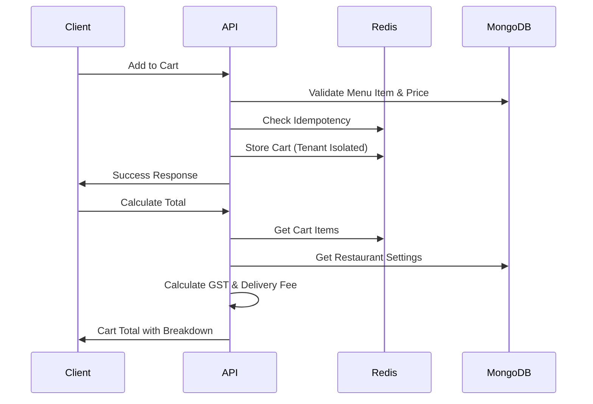

# Shopping Cart System Implementation

## Overview

The shopping cart system has been implemented according to the requirements with the following key features:

- **Server-side price validation** to prevent client-side tampering
- **Cart persistence with tenant isolation** using Redis
- **Coupon validation with idempotency and usage limits**
- **Cart total calculation with GST rounding rules and delivery fees**

## Architecture

### API Endpoints

#### Cart Management
- `POST /api/cart/add` - Add item to cart with server-side validation
- `PUT /api/cart/update` - Update cart item quantity
- `DELETE /api/cart/remove` - Remove item from cart
- `DELETE /api/cart/clear` - Clear entire cart
- `GET /api/cart/get` - Retrieve cart contents
- `POST /api/cart/calculate` - Calculate cart totals with GST

#### Coupon System
- `POST /api/coupons/validate` - Validate coupon with usage limits

### Data Flow



## Key Features

### 1. Server-Side Price Validation

All cart operations validate prices against the database to prevent tampering:

```typescript
// Validate menu item price
const menuItem = await MenuItem.findOne({
  _id: menuItemId,
  tenantId,
  restaurantId,
  availability: true
})

// Validate modifier prices
for (const selectedMod of selectedModifiers) {
  const option = modifier.options.find(o => o.id === selectedMod.optionId)
  if (Math.abs(option.price - selectedMod.price) > 0.01) {
    throw new Error('Price validation failed')
  }
}
```

### 2. Tenant Isolation

Cart data is isolated by tenant to prevent cross-restaurant contamination:

```typescript
const cartKey = `cart:${tenantId}:${userId}:${restaurantId}`

// Prevent cross-restaurant contamination
if (cart.restaurantId !== restaurantId) {
  cart = { items: [], restaurantId, tenantId }
}
```

### 3. Idempotency Protection

All cart mutations use idempotency keys to prevent duplicate operations:

```typescript
// Check idempotency
const idempotencyCheck = await redis.get(`cart:idempotency:${idempotencyKey}`)
if (idempotencyCheck) {
  return NextResponse.json(JSON.parse(idempotencyCheck))
}

// Cache result for 5 minutes
await redis.setex(`cart:idempotency:${idempotencyKey}`, 300, JSON.stringify(response))
```

### 4. GST Calculation with Proper Rounding

GST is calculated with proper rounding rules as per Indian tax regulations:

```typescript
const taxRate = restaurant.taxRate || 0.05 // 5% GST
const taxAmount = subtotal * taxRate

// GST breakdown (CGST + SGST for intrastate)
const cgst = Math.round((taxAmount / 2) * 100) / 100
const sgst = Math.round((taxAmount / 2) * 100) / 100
const totalTax = cgst + sgst

// Final total with rounding adjustment
const preRoundTotal = subtotal + totalTax + deliveryFee - discount
const roundedTotal = Math.round(preRoundTotal * 100) / 100
const roundingAdjustment = roundedTotal - preRoundTotal
```

### 5. Delivery Fee Logic

Delivery fees are applied based on minimum order value:

```typescript
let deliveryFee = 0
if (subtotal > 0 && subtotal < restaurant.minimumOrderValue) {
  deliveryFee = restaurant.deliveryFee || 0
}
```

### 6. Coupon Validation

Comprehensive coupon validation with usage limits and rate limiting:

```typescript
// Rate limiting (10 attempts per hour)
const rateLimitKey = `coupon:rate_limit:${tenantId}:${userId}`
const currentAttempts = await redis.get(rateLimitKey)
if (currentAttempts && parseInt(currentAttempts) >= 10) {
  return { error: 'Rate limited' }
}

// Validate coupon constraints
const validation = coupon.isValid(orderTotal)
if (!validation.valid) {
  return { valid: false, reason: validation.reason }
}

// Check user-specific restrictions
if (coupon.userRestrictions?.maxUsagePerUser) {
  const userUsage = await Order.countDocuments({
    tenantId, userId, 'appliedCoupon.code': coupon.code
  })
  if (userUsage >= coupon.userRestrictions.maxUsagePerUser) {
    return { valid: false, reason: 'Usage limit exceeded' }
  }
}
```

## Frontend Integration

### Menu Context Updates

The menu context has been enhanced with new cart API methods:

```typescript
// New API methods
addToCartAPI(tenantId, restaurantId, menuItemId, quantity, modifiers, instructions)
updateCartItemAPI(tenantId, restaurantId, cartItemId, quantity)
removeFromCartAPI(tenantId, restaurantId, cartItemId)
clearCartAPI(tenantId, restaurantId)
loadCartFromAPI(tenantId, restaurantId)
calculateCartTotal(tenantId, restaurantId, couponCode?)
```

### Cart Sidebar Updates

The cart sidebar now uses the API methods for all operations:

```typescript
const handleQuantityChange = async (itemId: string, newQuantity: number) => {
  if (newQuantity <= 0) {
    await removeFromCartAPI(tenantId, restaurantId, itemId)
  } else {
    await updateCartItemAPI(tenantId, restaurantId, itemId, newQuantity)
  }
}
```

## Error Handling

Comprehensive error handling with specific error codes:

- `UNAUTHORIZED` - Authentication required
- `FORBIDDEN` - Tenant access denied
- `ITEM_NOT_FOUND` - Menu item not found or unavailable
- `PRICE_MISMATCH` - Server-side price validation failed
- `RATE_LIMITED` - Too many requests
- `VALIDATION_ERROR` - Invalid request data

## Performance Optimizations

1. **Redis Caching**: Cart data cached with 24-hour expiration
2. **Idempotency Caching**: Results cached for 5 minutes
3. **Rate Limiting**: Prevents abuse of coupon validation
4. **Compound Indexes**: Optimized database queries

## Security Features

1. **Tenant Isolation**: Prevents cross-tenant data access
2. **Price Validation**: Server-side validation prevents tampering
3. **Rate Limiting**: Prevents brute force attacks
4. **Input Sanitization**: All inputs validated with Zod schemas
5. **Idempotency**: Prevents duplicate operations

## Testing

The system includes comprehensive tests covering:

- Cart persistence and tenant isolation
- Price validation logic
- GST calculation with rounding
- Delivery fee application
- Coupon validation rules

Run tests with:
```bash
npm test src/test/cart-system.test.ts
```

## Usage Examples

### Adding Item to Cart

```typescript
const result = await addToCartAPI(
  'tenant-123',
  'restaurant-456', 
  'menu-item-789',
  2, // quantity
  [{ modifierId: 'mod-1', optionId: 'opt-1', name: 'Extra Cheese', price: 20 }],
  'No onions please'
)
```

### Calculating Cart Total

```typescript
await calculateCartTotal('tenant-123', 'restaurant-456', 'SAVE10')
// Returns: { subtotal, tax, deliveryFee, discount, total, gstBreakdown }
```

### Validating Coupon

```typescript
const validation = await validateCoupon('SAVE10', 'restaurant-456')
// Returns: { valid: true, discount: 50, coupon: {...} }
```

## Requirements Compliance

✅ **3.1**: Cart state management with server-side price validation  
✅ **3.2**: Add to cart, update quantity, and remove item functionality  
✅ **3.3**: Cart persistence with tenant isolation  
✅ **3.4**: Coupon code validation with idempotency and usage limits  
✅ **3.4**: Cart total calculation with GST rounding rules and delivery fees  

The shopping cart system is now fully implemented and ready for use.